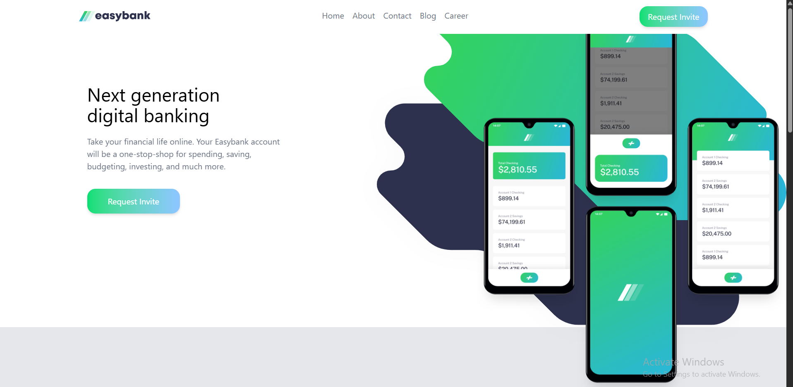
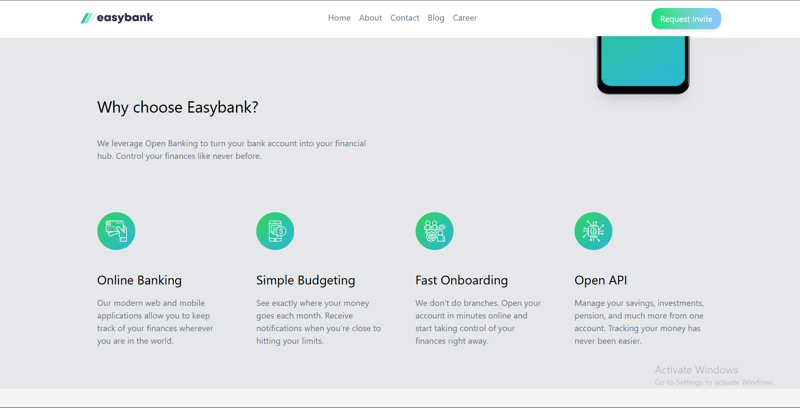
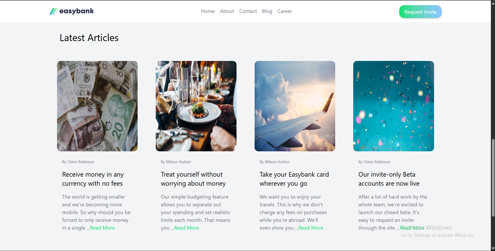
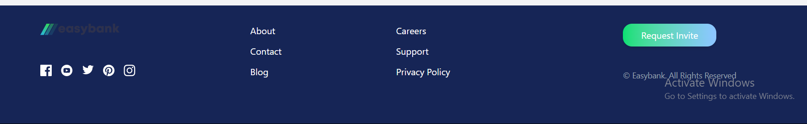

# Frontend Mentor - Easybank landing page solution

This is a solution to the [Easybank landing page challenge on Frontend Mentor](https://www.frontendmentor.io/challenges/easybank-landing-page-WaUhkoDN). Frontend Mentor challenges help you improve your coding skills by building realistic projects.

## Table of contents

- [Overview](#overview)
    - [The challenge](#the-challenge)
    - [Screenshot](#screenshot)
    - [Links](#links)
- [My process](#my-process)
    - [Built with](#built-with)
    - [What I learned](#what-i-learned)
    - [Continued development](#continued-development)
    - [Useful resources](#useful-resources)
- [Author](#author)
- [Acknowledgments](#acknowledgments)

## Overview

### The challenge

Users should be able to:

- View the optimal layout for the site depending on their device's screen size
- See hover states for all interactive elements on the page

### Screenshot
These below are the screenshots of the final project.






### Links

- Solution URL: [GitHub Repository for the solution](https://github.com/rctrollex/easybank_landing_page)
- Live Site URL: [EasyBank Live Link](https://www.easybank-rctrollex.vercel.app)

## My process
I used React js and Tailwind CSS.React Js role was to code the states for changing the logo and opening a mobile navigation bar. Tailwind CSS, I used it for styling every component in this project, from navbar to footer.
How I created this project;
- I started by creating a new project in React js and created the repo to push my commits.
- Then set the project by creating the components folder which includes navbar, footer, hero section, mobile navigation and the 2 sections in the project.
- Then I created the pages folder which includes the home page.
- I imported the assets and set the project dependencies and packages like Tailwind.
- Then started creating the components and styling them whilst getting help from Tailwind docs and Ai for concepts I was not knowing.
- All the components I created are connected in the Home.jsx file to keep it clean.
- I used chrome dev tools to check the responsiveness of the project.
### Built with

- Semantic HTML5 markup
- CSS custom properties
- Flexbox
- CSS Grid
- Mobile-first workflow
- [React](https://reactjs.org/) - JS library
- [Tailwind CSS](https://tailwindcss.com/) - For styles

### What I learned

I learned to use Chrome dev tools for checking for mobile responsiveness on different devices. I also learnt responsiveness using Tailwind Docs and Ai, with a tip of having a mindset where i should start by addressing the mobile first then later on other screens like md, lg and xl.
This project also helped me to recap the grid system, flex boxes and containers how they work as they were crucial in creating different components and custom layouts of certain components.
I was also amazed by the creative design Tailwind CSS can provide to create their type components and layouts. For example the button component for Request invite which has a background gradient and some hover styles and as well as other hover styles on text on other components.


Some of the most important code snippets I used are as follows:

```html
// how I applied the grid for cards in project
<div className="grid grid-cols-1 md:grid-cols-2 lg:grid-cols-4 gap-6 container mx-auto px-4 pt-16">
```

```html
// how I applied flex for cards in project
<div className="flex flex-col h-full p-4 text-center md:text-start">
  <div className="container flex justify-center md:justify-start">
    
  </div>
  <h3 className="mt-10 text-2xl">Online Banking</h3>
  <p className="text-gray-500 text-base sm:text-base  pt-4">Our modern web and mobile applications allow you to keep track of your finances wherever you are in the world.</p>
</div>
```

```js
// some code snippet where a React hook useState was used to store state whether the mobile nav bar is open or closed.
const [isOpen, setIsOpen] = useState(false);
return(
    <div className="md:hidden px-2">
      <button className="text-gray-500 hover:text-white focus:outline-none" onClick={()=>setIsOpen(!isOpen)}>
        {isOpen ?  : }
      </button>
    </div>
)
```

### Continued development

I would like to continue and learn more about backgrounds and pictures, the concepts like positioning and z-index. I would also like to learn more the sizing of images and how to make them be more responsive and avoid overflows.

### Useful resources

- [Grids](https://tailwindcss.com/docs/grid-template-columns) - This helped me for the grid layout to arrange the cards properly on different screen sizes. I really liked this grid system and will use it going forward.
- [Responsive Designs](https://tailwindcss.com/docs/responsive-design) - This is an amazing information on responsiveness in Tailwind CSS which helped me finally understand how do I treat different screen sizes, first useful tip is to start addressing mobiles on responsive design. I'd recommend it to anyone still learning this concept.

## Author

- Frontend Mentor - [@rctrollex](https://www.frontendmentor.io/profile/rctrollex)
- Twitter - [@rctrollex](https://www.x.com/rctrollex)
- LinkedIn - [Ryan Chigwengwe](https://www.linkedin.com/in/ryan-chigwengwe-3b594130a/)
- Github - [rctrollex](https://github.com/rctrollex)

